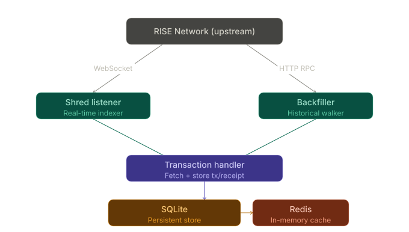
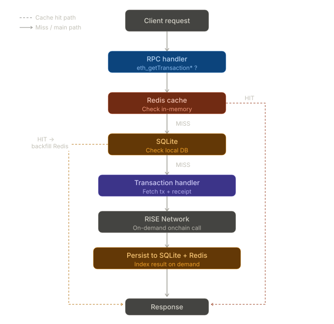

# Indexing Risechain service

A POC high-performance Rise blockchain data streaming and indexing platform built for Rise chain.

## Architecture

### Sherds subcribe service



### RPC Request flow



## Quick start

### Prerequisites

### 1. Configure environment

```bash
touch .env
```

Setup env

```env
RISE_RPC_URL=https://testnet.riselabs.xyz
RISE_WS_URL=wss://testnet.riselabs.xyz/ws
SERVER_ADDR=0.0.0.0:8545
DB_PATH=/data/rise.db
REDIS_URL=redis://cache:3000
RUST_LOG=rise_indexer=info
```

### 2. Start indexer

```bash
docker compose build -d
```

Services:

| Service   | Description                          | Port |
| --------- | ------------------------------------ | ---- |
| `indexer` | JSON-RPC proxy + background indexers | 8545 |
| `redis`   | Redis in-memory cache                | 6379 |
| `database`| SQLite Web browser UI                | 5432 |

### 3. Browse the Sqlite3-UI

Open [http://localhost:5432](http://localhost:5432) to inspect indexed transactions
and receipts via the SQLite Web UI.
